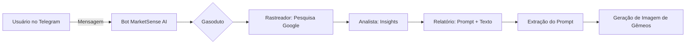
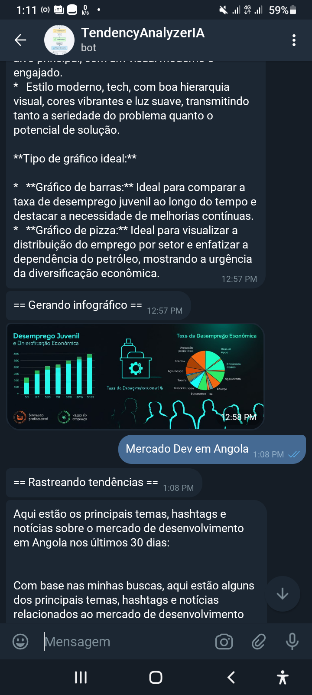
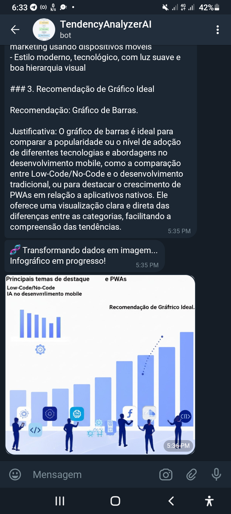

# **MarketSense AI**

### **Agente de Inteligência de Mercado com Google Gemini**

<p align="center">
  
</p>


---
````
## Sumário
- Visão Geral
- Funcionalidades
- Instalação
- Arquitetura
- Estrutura de Pastas
- Tecnologias Utilizadas
- Exemplos de Uso
- Sobre o Autor
- Contribua
- Licença
````

## **📌 Visão Geral**

**MarketSense AI** é um bot inovador que combina o poder do **Google Gemini** com módulos personalizados no **Telegram** para rastrear, analisar e gerar relatórios multimodais sobre tendências de mercado em tempo real. Criado por **Borge Levisberg**, este projeto nasceu da inspiração da **Aula 5 da Imersão IA Alura** e foi projetado para rodar localmente no **Termux** com o editor **Acode**, tornando-o uma ferramenta acessível para desenvolvedores que preferem ambientes mobile-first.

O objetivo do MarketSense AI é transformar dados brutos da web em insights acionáveis, entregando relatórios detalhados e infográficos visuais diretamente no Telegram. Seja para analisar tendências emergentes, identificar oportunidades de mercado ou criar conteúdo estratégico.

### **Principais Funcionalidades**
- **🔍 Rastreamento de tendências**: Utiliza a busca do Google para coletar notícias, hashtags e temas em alta.
- **📊 Análise de mercado**: Extrai insights como sentimento geral, público-alvo, palavras-chave e oportunidades de produto ou conteúdo.
- **📝 Relatório multimodal**: Produz um resumo executivo em markdown, um prompt de imagem para o Gemini e uma sugestão de gráfico.
- **🖼️ Infográfico automático**: Gera e envia ao Telegram infográficos modernos (com gráficos de barras e pizza) via Gemini Image Generation.

---

## **🚀 Instalando e Executando**

Configure o **MarketSense AI** no seu ambiente local (Termux + Acode) com os passos abaixo. As instruções são detalhadas para garantir que até iniciantes possam começar rapidamente!

### **1. Clone o Repositório**
```bash
git clone https://github.com/borgelevisberg17/MarketSenseIA.git
cd MarketSenseIA
```

### **2. Instale as Dependências**
Atualize o Termux e instale os pacotes necessários:
```bash
pkg update && pkg upgrade
pkg install python git
pip install --upgrade pip
pip install -r requirements.txt
```

> **Dica**: Caso tente instalar no celular que nem eu e enfrente erros com dependências no Termux, adicione `--no-bin-links` ao instalar pacotes Python, como `pip install pillow --no-bin-links`.

### **3. Configure as Variáveis de Ambiente**
Crie um arquivo `config.py` na raiz do projeto com as chaves de API:
```python
GOOGLE_API_KEY = "sua_google_api_key_aqui"
TELEGRAM_TOKEN = "seu_telegram_token_aqui"
```
- **GOOGLE_API_KEY**: Obtenha sua chave no [Google AI Studio](https://aistudio.google.com/).
- **TELEGRAM_TOKEN**: Crie um bot com o [BotFather](https://t.me/BotFather) no Telegram.

### **4. Execute o Bot**
Inicie o script principal:
```bash
python marketAgent.py
```

> **Nota**: Para rodar o bot em segundo plano no Termux, use `tmux`:  
> ```bash  
> tmux new -s marketsense  
> python marketAgent.py  
> ```
> Saia do tmux com `Ctrl+B` e depois `D` sem interromper o bot.

### **5. Interaja no Telegram**
- Envie `/start` para ativar o bot.
- Digite um tópico, como "Índice de ex-militares como sem-teto nos EUA", e receba um relatório completo com infográfico.

---

## **🏗️ Arquitetura do Projeto**

O **MarketSense AI** é estruturado em um pipeline modular com três agentes principais, cada um desempenhando um papel essencial no processamento dos dados:



- **Rastreador**: Busca dados relevantes na web usando o Google Search.
- **Analista**: Processa os dados e gera insights estratégicos.
- **Relatório**: Cria um resumo em markdown e um prompt para infográficos.

---

## **📁 Estrutura de Pastas**

A organização do projeto é simples e funcional. Aqui está o que cada arquivo e pasta faz:

```
marketsense-ai/
├─ config.py           # Armazena as chaves de API (GOOGLE_API_KEY, TELEGRAM_TOKEN)
├─ marketAgent.py             # Script principal com o loop do bot Telegram
├─ README.md           # Documentação completa do projeto (você está aqui!)
├─ borg3_logs.txt      # Registro de logs para debug e monitoramento
├─ requirements.txt    # Lista de dependências 
├── LICENSE             # Licença MIT do projeto
```

---

## **🔧 Tecnologias Utilizadas**

O MarketSense AI foi construído com ferramentas modernas e acessíveis:

- **Python 3.10+**: Linguagem principal do projeto.
- **Google Gemini API** ([documentação](https://ai.google.dev/docs)): Para agentes de IA e geração de imagens.
- **Telegram Bot API** via [python-telegram-bot](https://python-telegram-bot.org/): Integração com o Telegram.
- **Termux** ([site oficial](https://termux.com/)): Ambiente de execução no Android.
- **Acode** ([GitHub](https://github.com/deadlyjack/Acode)): Editor de código mobile-first.
- **Pillow (PIL)**: Manipulação de imagens geradas pelo Gemini.
- **python-dotenv**: Gerenciamento seguro de variáveis de ambiente.

---

## **🎯 Hashtags da Imersão**

#ImersaoIA #Alura #GoogleGemini #MarketSenseAI #DataScience #AI #TelegramBot #Termux #MobileDev #Python #InteligenciaArtificial

---

## **✍️ Sobre o Autor**

**Borge Levisberg** é um desenvolvedor Full Stack apaixonado por tecnologia e inovação. Com experiência em **.NET MAUI**, **Blazor**, **Python**, **Node.js**, **Cybersecurity**, e outros, ele adora criar soluções que unem funcionalidade e criatividade.  
📍 **Angola**  
📚 **Interesses**: Música, fanfics, aprendizado de idiomas (inglês, chinês e persa).  
🚀 **Missão**: Inspirar outros a explorar o potencial da tecnologia.

> "A curiosidade é a senha para o sucesso. Continue explorando e criando!"  
> — Borge Levisberg

---

## **📸 Imagens do Projeto**

### **Exemplo de Interação no Telegram**
  
*telegram.*

### **Infográfico Gerado**
  
*gemini.*

---

## **📚 Recursos Adicionais**

- **Google Gemini**: [ai.google.dev](https://ai.google.dev/)
- **Guia do Termux**: [wiki.termux.com](https://wiki.termux.com/)
- **Tutorial de Bots no Telegram**: [core.telegram.org/bots](https://core.telegram.org/bots)
- **Editor Acode**: [GitHub - Acode](https://github.com/deadlyjack/Acode)

---

## **🤝 Contribua com o Projeto**

Quer ajudar a melhorar o MarketSense AI? Abra uma issue, envie um pull request ou sugira novas funcionalidades no [repositório do GitHub](https://github.com/borgelevisberg17/MarketSenseIA). Toda contribuição é bem-vinda!

---

**Licença**: Este projeto está sob a licença MIT. Veja mais detalhes no arquivo [LICENSE](LICENSE).

